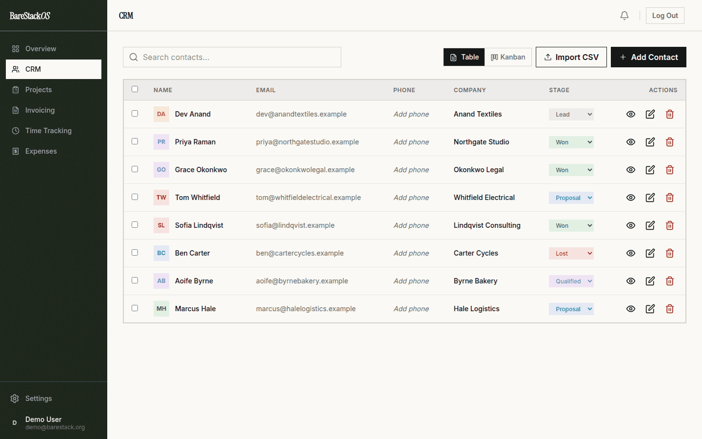
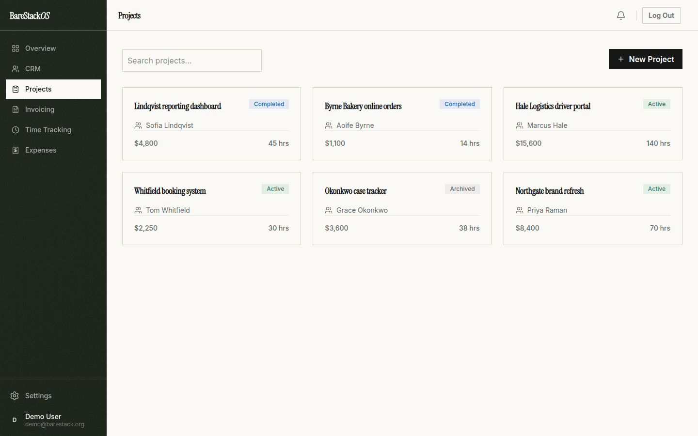
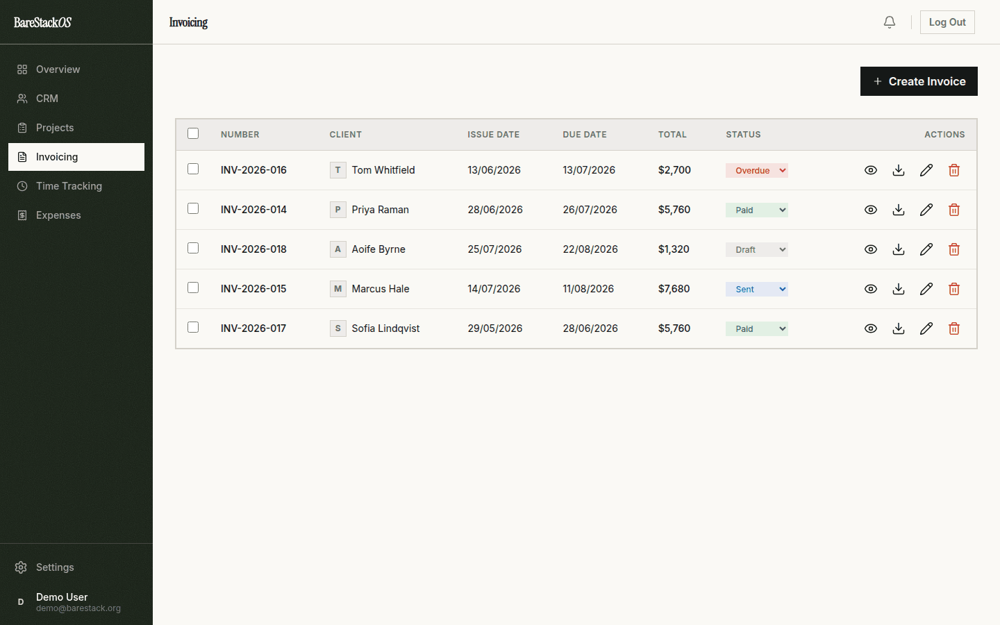

# BareStack*OS*

An open-source business operating system for agencies and freelancers: CRM, deal pipeline, projects, time tracking, invoicing, expenses and reports in one self-hostable app. Built with React, TypeScript, PocketBase, and Tailwind CSS.

**[Try the live demo](https://demo.barestack.org).** No sign-up. It resets every hour.

<table>
  <tr>
    <td width="33%"></td>
    <td width="33%"></td>
    <td width="33%"></td>
  </tr>
  <tr>
    <td align="center">Contacts and pipeline</td>
    <td align="center">Projects</td>
    <td align="center">Invoicing</td>
  </tr>
</table>

## Quick Start (One Command)

```bash
curl -sSL https://raw.githubusercontent.com/anirudhprashant/barestack-app/main/install.sh | bash
```

Or if you already have the repo:

```bash
./install.sh
```

By default this is a **fully self-hosted** install: the app talks to a PocketBase
instance running on your own machine. Your data lives in `./pb_data` and never
touches the BareStack cloud.

This will:
1. Install npm dependencies
2. Download PocketBase (the pinned, tested version)
3. Apply the database schema from `pb_migrations/` (collections + owner-only access rules)
4. Create a PocketBase admin with a randomly generated password (printed once)
5. Build the frontend pointed at your local PocketBase
6. Create a `start.sh` script

Then run `./start.sh` to launch.

> **Want to use the hosted BareStack cloud instead of your own backend?**
> Run `./install.sh --cloud`. This builds the frontend against `api.barestack.org`
> and skips the local PocketBase setup.

---

## Manual Setup

### 1. Install Dependencies

```bash
npm install
```

### 2. Download PocketBase

Download the **pinned** version (the installer uses the same one; newer majors
change the admin API and may not match these migrations):

```bash
PB_VERSION=0.36.2
# Linux amd64 (use linux_arm64 / darwin_arm64 / darwin_amd64 as appropriate):
curl -fL "https://github.com/pocketbase/pocketbase/releases/download/v${PB_VERSION}/pocketbase_${PB_VERSION}_linux_amd64.zip" -o pocketbase.zip
unzip -o pocketbase.zip pocketbase
chmod +x pocketbase
```

### 3. Apply the Schema

The collections and their owner-only access rules are version-controlled in
`pb_migrations/`. Apply them — no manual collection creation needed:

```bash
./pocketbase migrate up --dir ./pb_data --migrationsDir ./pb_migrations
```

Then create an admin (superuser):

```bash
./pocketbase superuser upsert admin@barestack.local "$(openssl rand -base64 18)" --dir ./pb_data
```

### 4. Configure Environment

Create a `.env` file pointing at your local PocketBase:

```env
VITE_POCKETBASE_URL=http://127.0.0.1:8092
```

### 5. Build and Run

```bash
./pocketbase serve --dir ./pb_data --migrationsDir ./pb_migrations --hooksDir ./pb_hooks --http="0.0.0.0:8092" &
npm run build
PORT=8080 node serve.cjs
```

`serve.cjs` is a small dependency-free static server with security headers,
gzip, long-lived caching for fingerprinted assets and SPA routing. Put it (and
PocketBase) behind a TLS-terminating reverse proxy for anything public.

Open http://localhost:8080

---

## Features

**CRM**
- Contacts with tags, inline editing, search, tag filters, sort, CSV export and bulk actions
- Contact profiles with deals, projects, invoices, lifetime value and editable notes
- Deal pipeline (Lead → Qualified → Proposal → Won/Lost) with drag and drop, titles, values, expected close dates, win rate and open pipeline value
- CSV / Excel import with duplicate handling (skip, update or create, per row or all at once) and one-click undo

**Projects & time**
- Projects with budget, estimated hours, hourly rate, due date and live progress (hours, budget used, tasks)
- Task boards with priorities, due dates, overdue flags, edit and delete
- Start/stop timer that survives reloads and syncs across tabs, plus manual entries (`1.5`, `1:30` or `90m`)
- Weekly hours chart with week navigation, billable vs non-billable, CSV export

**Money**
- Invoices with multiple line items, tax, notes, custom numbering (`INV-2026-001`) and automatic overdue detection
- **Bill unbilled time in one click**: billable hours become invoice lines at the project rate, and the entries are marked as billed
- Branded PDF invoices with your business details, payment instructions and currency; preview, download, ZIP of many, or email to the client
- Expenses with categories, projects, receipt links, period filters and CSV export
- Reports: revenue vs expenses by month, profit and margin, top clients, hours by project, expenses by category

**Workspace**
- Command palette (Ctrl/⌘ + K) to jump to any contact, project or invoice, or start a timer
- Notifications for overdue invoices, tasks due and deals past their close date
- Business profile: name, address, tax ID, currency, default tax rate, payment terms and invoice footer
- Getting-started checklist, activity log, responsive on phones
- **Your data is portable**: CSV export, full JSON backup, and restore into any BareStackOS instance (cloud → self-hosted and back)
- Account settings: name, email change, password change, and full account deletion

---

## Upgrading

Pull, rebuild, and restart PocketBase with `--migrationsDir ./pb_migrations`
(the bundled `start.sh` already does). New migrations apply automatically and
only *add* things; existing data is untouched.

```bash
git pull
npm ci
VITE_POCKETBASE_URL=<your PocketBase URL> npm run build
./start.sh
```

## Email and account verification

New accounts must verify their email before they can see any data. When
PocketBase has **no SMTP configured** (the default for a fresh self-hosted
install), there is no way to deliver that email, so new sign-ups are verified
automatically (`pb_hooks/auth.pb.js`). As soon as you enable SMTP in the
PocketBase dashboard (`/_/` → Settings → Mail settings), normal verification
emails are used. Set `BARESTACK_REQUIRE_EMAIL_VERIFICATION=true` in
PocketBase's environment to always require verification.

---

## Tech Stack

- **Frontend**: React 18, TypeScript (strict), Vite 7, Tailwind CSS 4
- **Backend**: PocketBase (self-hosted, open-source)
- **Fonts**: Instrument Serif + Inter + Plus Jakarta Sans (Google Fonts)
- **PDF**: jsPDF with AutoTable

---

## Security

- **Filter Injection Prevention**: All user IDs are sanitized with regex validation
- **Input Validation**: Required fields enforced on all forms
- **Security Headers**: CSP, X-Frame-Options, X-Content-Type-Options, Referrer-Policy
- **Auth**: JWT-based via PocketBase authStore
- **Data Isolation**: Server-side PocketBase rules: users can only read and write their own records, and can't move a record into someone else's account
- **Safe exports**: CSV exports neutralise spreadsheet formulas (CSV injection)
- **Secrets**: Environment-based, never committed to git

---

## Project Structure

```
├── components/      # React components (forms, command palette, UI kit)
├── pages/          # Page components
├── pb_migrations/  # PocketBase schema + access rules (applied automatically)
├── pb_hooks/       # Server-side hooks (activity integrity, verification)
├── src/
│   ├── context/   # Toasts, timer
│   ├── lib/       # API, dates, money, invoices, PDF, backup, CSV
│   └── style.css   # Tailwind styles
├── vite.config.ts  # Vite + security headers
├── index.html      # Entry + Google Fonts
├── types.ts        # TypeScript types
├── dataStore.tsx   # State management
├── install.sh      # One-line installer
└── start.sh        # Launcher script
```

---

## License

AGPL-3.0. Run it, modify it, self-host it, no charge and no seat limits.
If you distribute a modified version, or run one as a network service for
others, you have to publish your source under the same licence. See LICENSE
for the full text.
